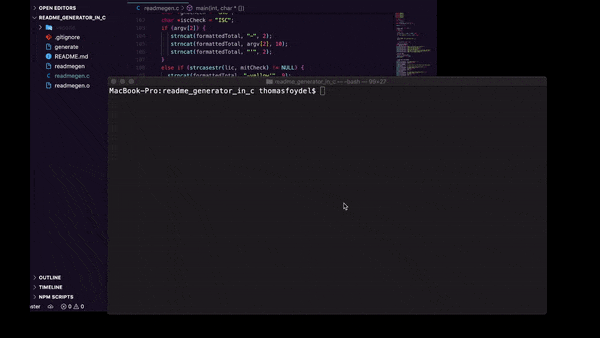

<h1 align='center'>README Generator in C</h1>

<a href='#description'>Description</a>

<a href='#installation'>Installation</a>

<a href='#usage'>Usage</a>

<a href='#license'>License</a>

<a href='#questions'>Questions</a>

<h2 align='center'>Description</h2>

A command line interface tool for generating nice good looking README files

<h2 align='center'>Installation</h2>

Download it, compile the readmegen.c file, you need gcc or something equivalent, with gcc installed, open terminal and cd to the folder that contains readmegen.c and use the command

<strong>gcc readmegen.c</strong>

to compile it into an executable file named <strong>a.out</strong>

A compiled and executable file named "generate" is also included in this repo if you don't want to compile it yourself

<h2 align='center'>Usage</h2>

Run the command

<strong>./a.out</strong>

Or, if you are using the file that comes with this repo, use the command

<strong>./generate</strong>

then answer the prompts with your app's information

If you supply one argument after a.out or generate, like

<strong>./a.out MYREADME.md</strong>

then it will write a file with that argument as its name

If no argument is provided, the default of <strong>README.md</strong> will be used

If you provide two arguments like so

<strong>./a.out MYREADME.md orange</strong>

or

<strong>./generate NEWREADME.md #aaa111</strong>

The second argument will be used as the color of the license badge. Color names or hexcodes can be used. If no second argument exists, license color will be based on the license used, and will default to a light blue if the license is not recognized. If the a second argument is given but the color is not valid, the color will default to green.

<h2 align='center'>License</h2>

</img>

<h2 align='center'>Questions</h2>

Any questions on this or other projects can be directed to thomasjfoydel@gmail.com

<h2 align='center'>More Of My Projects</h2>

Find more of my work on <a href='https://github.com/thomasfoydel'>my GitHub</a>

